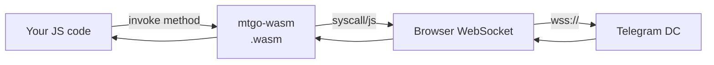

<div align="center">

# mtgo-wasm

[](https://go.dev/)
[](https://github.com/mtgo-labs/mtgo)
[](LICENSE)
[](https://www.npmjs.com/package/@mtgo-labs/wasm)

<p><strong>mtgo-wasm</strong> brings the <a href="https://github.com/mtgo-labs/mtgo">mtgo</a> Telegram MTProto client to the browser via WebAssembly. It exposes a small JavaScript API for creating a client, connecting over WebSocket, and invoking arbitrary Telegram TL methods — all running client-side in the browser.</p>

</div>



## Quick start

```bash
make build       # produces mtgo-wasm.wasm
make copy-exec   # copies Go's wasm_exec.js into lib/
make serve       # starts a demo server at http://localhost:8080/
```

Open the demo, enter your API credentials + bot token (or session string), and
click **Connect**.

## Usage

```html
<script src="lib/wasm_exec.js"></script>
<script type="module">
  import { load } from "./lib/mtgo-wasm.js";

  const mtgo = await load("./mtgo-wasm.wasm", "./lib/wasm_exec.js");

  const client = mtgo.createClient({
    apiID: 12345,
    apiHash: "your_api_hash",
    botToken: "123:ABCdefGHI",          // or sessionString for a user session
  });

  await client.connect();
  console.log("Logged in as", client.me());

  // Invoke any TL method by name (snake_case params):
  const result = await client.invoke("users.getUsers", {
    id: [{ _: "inputUserSelf" }],
  });
  console.log(result);

  await client.disconnect();
</script>
```

## API

### `MtgoWasm.createClient(opts) → client`

| Option           | Type       | Required | Description                                      |
|------------------|------------|----------|--------------------------------------------------|
| `apiID`          | `number`   | yes\*    | Telegram API ID from my.telegram.org             |
| `apiHash`        | `string`   | yes\*    | Telegram API hash                                |
| `botToken`       | `string`   | no       | Bot token — triggers bot auth on connect         |
| `sessionString`  | `string`   | no       | Pre-authenticated session (Telethon/Pyrogram/etc)|
| `phoneNumber`    | `string`   | no       | Phone number for interactive user login          |
| `codeFunc`       | `function` | no       | `async (phone) => code` — OTP provider           |
| `passwordFunc`   | `function` | no       | `async (hint) => password` — 2FA password        |

\* `apiID`/`apiHash` optional only when `sessionString` carries them.

### `client.connect() → Promise<void>`

Establishes the WebSocket transport, performs the DH key exchange, and
authenticates (bot login or session restore). Returns a Promise.

### `client.invoke(method, params) → Promise<object>`

Invokes a Telegram TL method by name. `method` is the TL function name
(e.g. `"messages.sendMessage"`). `params` is a plain JS object using
snake_case keys matching the TL schema. Returns the parsed response.

### `client.me() → object | null`

Returns the authenticated user (`{ id, username, first_name, last_name, is_bot }`),
or `null` if not connected.

### `client.disconnect() → Promise<void>`

Closes the transport and releases the session.

## How it works

mtgo is a pure-Go MTProto client. This repo adds two things:

1. **A browser WebSocket transport** — `wasm/wsconn.go` wraps the browser's
   native `WebSocket` API as a Go `net.Conn`. mtgo's obfuscated2 framing layer
   sits on top, exactly as it does for server-side WebSocket connections.

2. **A JS bridge** — `wasm/bridge.go` uses `syscall/js` to expose
   `createClient`/`connect`/`invoke`/`disconnect` to JavaScript. RPC calls go
   through mtgo's `InvokeJSON`, so **every TL method** is available without
   per-method glue code.

The mtgo side needs one hook: `Config.WSDialer` (landed in the mtgo release
after v0.12.0) lets this repo inject the browser WebSocket as the transport
without reaching into mtgo internals.

## Transport notes

- Traffic flows over **`wss://`** (TLS) to Telegram's WebSocket endpoints
  (`pluto.web.telegram.org/apiws`, etc.). WebSocket connections are not bound
  by fetch CORS rules, so browsers can reach Telegram directly — GramJS and
  Telegram Web do the same.
- All storage is **in-memory** (`InMemory: true`). No filesystem is used.

## SvelteKit / Vite integration

The plain-browser loader (`lib/mtgo-wasm.js`) uses dynamic `<script>` injection
which fights Vite's ESM module system. Use `lib/mtgo-wasm-vite.js` instead.

### 1. Copy WASM assets to `static/`

```bash
cp mtgo-wasm.wasm        your-sveltekit-app/static/
cp lib/wasm_exec.js      your-sveltekit-app/static/
```

### 2. Load `wasm_exec.js` in `app.html`

```html
<!-- src/app.html — inside <head> -->
<script src="%sveltekit.assets%/wasm_exec.js"></script>
```

This makes the global `Go` class available before your app boots.

### 3. Use the Vite loader + Svelte component

```svelte
<!-- src/routes/+page.svelte -->
<script>
  import { onMount } from "svelte";

  let mtgo = null;
  let client = null;

  onMount(async () => {
    // onMount only runs in the browser — SSR-safe.
    const { load } = await import("../../lib/mtgo-wasm-vite.js");
    // Or copy the loader into src/lib/ for cleaner imports:
    // const { load } = await import("$lib/mtgo-wasm-vite.js");

    mtgo = await load({
      wasmUrl: "/mtgo-wasm.wasm",
      // wasmExecUrl not needed if loaded via app.html <script>
    });

    client = mtgo.createClient({
      apiID: 12345,
      apiHash: "your_hash",
      botToken: "123:ABC",
    });
    await client.connect();
    const me = await client.invoke("users.getUsers", { id: [{ _: "inputUserSelf" }] });
    console.log(me);
  });
</script>
```

Or drop in the ready-made component:

```svelte
<script>
  import MTGoClient from "../../examples/svelte/src/lib/MTGoClient.svelte";
</script>

<MTGoClient />
```

### Key points

- **SSR safety**: `onMount` only runs client-side. Never call `load()` during SSR — WASM has no server context.
- **`Go` global**: `wasm_exec.js` sets `globalThis.Go`. Load it once via `app.html`, not per-component.
- **Static assets**: Files in `static/` are served at the root path by SvelteKit, matching `wasmUrl: "/mtgo-wasm.wasm"`.

## Building

```bash
GOOS=js GOARCH=wasm go build -o mtgo-wasm.wasm .
```

Requires Go 1.22+ (for `math/rand/v2`) and the mtgo version that ships
`Config.WSDialer` + `telegram.NewWSDialer`.

## License

MIT, same as mtgo.
